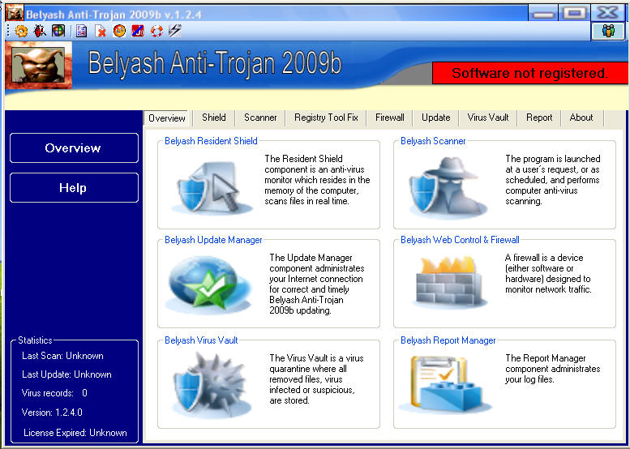



## Belyash Anti\-Trojan Antivirus

### Description

Detect and cure OS....Delete worm,trojan,spy.File Monitor(Shield),Scanner,Registry Monitor,Console Scanner,cure registry,delete ie history.

Download base-http://rapidshare.com/files/258396021/Base.zip.html
 
### More Info
 
know VB.Net &amp; Vb 6.0

dont anderstend

cured Os Windows

             |
---                |---
**Submitted On**   |2009-07-22 03:41:10
**By**             |[mrbelyash](https://github.com/Planet-Source-Code/PSCIndex/blob/master/ByAuthor/mrbelyash.md)
**Level**          |Intermediate
**User Rating**    |5.0 (15 globes from 3 users)
**Compatibility**  |VB 6\.0
**Category**       |[Files/ File Controls/ Input/ Output](https://github.com/Planet-Source-Code/PSCIndex/blob/master/ByCategory/files-file-controls-input-output__1-3.md)
**World**          |[Visual Basic](https://github.com/Planet-Source-Code/PSCIndex/blob/master/ByWorld/visual-basic.md)
**Archive File**   |[Belyash\_An2158167222009\.zip](https://github.com/Planet-Source-Code/mrbelyash-belyash-anti-trojan-antivirus__1-72299/archive/master.zip)

### API Declarations

any

